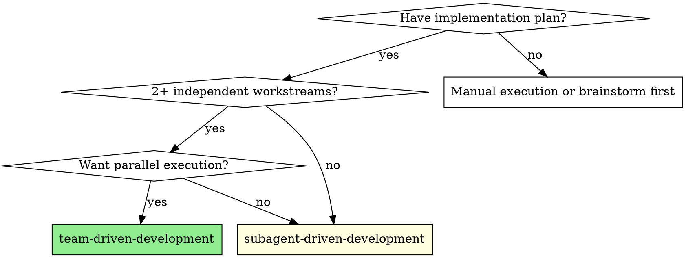
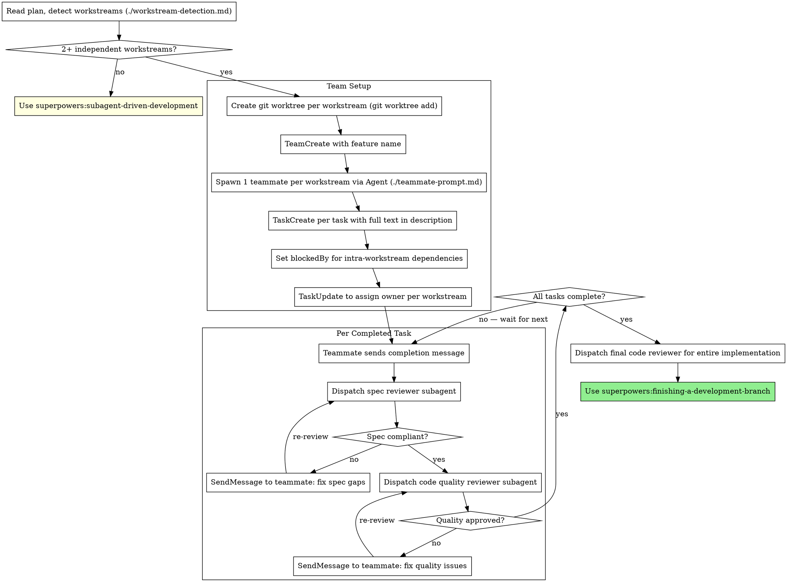

# Team-Driven Development

Execute plan by creating a coordinated team with parallel teammates, each owning an independent workstream, with two-stage review after each task.

**Core principle:** One teammate per workstream + parallel execution + two-stage review = fast, high-quality delivery.

**Announce at start:** "I'm using the team-driven-development skill to execute this plan with parallel workstreams."

## When to Use



**vs. Subagent-Driven Development (sequential):**
- Multiple teammates work concurrently (not one subagent at a time)
- Each teammate owns a full workstream (not one task)
- Shared task list for coordination (not controller re-dispatching)
- Same two-stage review quality (spec then quality)

**vs. Executing Plans (batched):**
- Same session (no context switch)
- Parallel workstreams (not sequential batches)
- Automated review (no human-in-loop between tasks)

## Workstream Detection

<HARD-GATE>
Do NOT create a team until you have analyzed the plan for independent workstreams.
Any plan with fewer than 2 independent workstreams MUST use subagent-driven-development instead.
</HARD-GATE>

Analyze the plan using `./workstream-detection.md`:

1. List all files each task creates or modifies
2. Group tasks sharing files into same workstream
3. Tasks with no file overlap = separate workstreams
4. Shared config/types (read-only) do NOT count as overlap
5. Result: < 2 workstreams → use subagent-driven-development

## The Process



## Team Setup

1. **Pre-tasks first** — install shared dependencies, add shared types, any setup work
   - <HARD-GATE>**COMMIT all pre-task changes before creating worktrees.** Worktrees fork from the current branch HEAD — uncommitted changes will NOT be visible to teammates. This is the #1 cause of teammate confusion.</HARD-GATE>
2. **Create git worktrees** — one per workstream, BEFORE spawning teammates
   - <HARD-GATE>**Each teammate MUST have their own git worktree (separate directory).** Teammates sharing the same working directory will have their git operations race and destroy each other's work. This is non-negotiable.</HARD-GATE>
   - For each workstream, run:
     ```bash
     git worktree add .claude/worktrees/{workstream-name} -b feat/{workstream-name}
     ```
   - This creates a separate directory with its own branch, forked from the current HEAD (which includes pre-task commits)
   - Example: `git worktree add .claude/worktrees/auth-backend -b feat/auth-backend`
   - Each worktree gets its own branch automatically — no checkout races
3. **TeamCreate** with a descriptive name (e.g., `"feature-auth"`)
4. **Spawn teammates** — one per workstream, max 4, using `./teammate-prompt.md`
   - Each teammate is `general-purpose` subagent type
   - Each teammate gets: architectural context + their workstream scope + **their worktree path**
   - In the teammate prompt, set the working directory to the worktree: include `cd {worktree-path}` as the FIRST instruction
   - Do NOT use `isolation: "worktree"` on the Agent tool — it does not create separate worktrees for team members
   - Do NOT tell teammates to create their own branches — the worktree already has one
5. **TaskCreate** for every task from the plan
   - Include full task text in `description` (don't make teammates read plan file)
   - Set `blockedBy` for intra-workstream dependencies
   - Set `activeForm` for progress visibility
6. **TaskUpdate** to assign `owner` based on workstream → teammate mapping

## Team Lead Role

**You coordinate. You do NOT implement.**

- Create team and tasks
- Assign tasks to teammates
- Dispatch review subagents when teammates report completion
- Message teammates with review feedback
- Handle cross-workstream issues (shared dependencies, merge conflicts)
- Shut down teammates when all work is done

## Review Coordination

Same two-stage review as subagent-driven-development. Reviews are lightweight subagents, NOT teammates.

1. Teammate completes task → sends completion message via SendMessage → **teammate STOPS and waits**
2. **Spec compliance review** — dispatch subagent using `subagent-driven-development/spec-reviewer-prompt.md`
   - **IMPORTANT:** The reviewer must work in the teammate's worktree directory (e.g., `.claude/worktrees/auth-backend`). Pass the worktree path to the reviewer subagent so it reads the correct files.
3. If spec fails → SendMessage to teammate with specific issues → teammate fixes → re-review
4. **Code quality review** — dispatch subagent using `subagent-driven-development/code-quality-reviewer-prompt.md`
   - Same worktree path rule applies.
5. If quality fails → SendMessage to teammate with issues → teammate fixes → re-review
6. Both pass → SendMessage to teammate: "Task approved, proceed to next" → task confirmed complete

Reviews for different workstreams can happen in parallel.

**Start code quality review ONLY after spec compliance passes.** Order matters.

## Completion

1. All tasks marked complete and reviewed
2. SendMessage `type: "shutdown_request"` to all teammates
3. Wait for shutdown confirmations
4. **Merge worktree branches** — for each worktree:
   ```bash
   git checkout {main-branch}
   git merge feat/{workstream-name} --no-ff
   ```
5. **Clean up worktrees**:
   ```bash
   git worktree remove .claude/worktrees/{workstream-name}
   ```
6. Dispatch final cross-workstream code reviewer (entire diff)
7. **REQUIRED SUB-SKILL:** Use superpowers:finishing-a-development-branch

## Red Flags

**Never:**
- Create a team for < 2 independent workstreams
- Have team lead implement code (coordination only)
- Skip workstream detection analysis
- Spawn > 4 teammates (coordination overhead exceeds parallelism gains)
- Skip reviews for team-completed work
- Let teammates work on overlapping files without coordination
- Start code quality review before spec compliance passes
- Use reviews as teammates (use lightweight subagents)
- Proceed past review failures

**Always:**
- Commit all pre-tasks before creating worktrees
- Create one git worktree per workstream BEFORE spawning teammates (`git worktree add`)
- Analyze plan for parallelism before creating team
- One teammate per workstream, each in their own worktree directory
- Review subagents work in the teammate's worktree directory (pass the path)
- Two-stage review (spec then quality) for every completed task
- Shut down teammates, merge branches, clean up worktrees when done

## Rationalization Prevention

| Excuse | Reality |
|--------|---------|
| "Only 2 tasks, team is overkill" | Count workstreams not tasks. 2 independent workstreams = use team. |
| "I can coordinate without a formal team" | Without TeamCreate/TaskCreate, no real parallelism. Use the tools. |
| "Teammates can share files" | File overlap = same workstream. Separate workstreams = no overlap. |
| "I'll skip reviews, teammates self-review" | Self-review supplements, never replaces. Two-stage review always. |
| "3+ workstreams, I need 5 teammates" | Max 4. Combine smallest workstreams until ≤ 4. |
| "Setting up a team takes too long" | TeamCreate + TaskCreate takes 30 seconds. Parallelism saves minutes. |

## Integration

**Required workflow skills:**
- **superpowers:writing-plans** — Creates the plan this skill executes
- **superpowers:finishing-a-development-branch** — Complete development after all tasks

**Reviews use (from subagent-driven-development):**
- `subagent-driven-development/spec-reviewer-prompt.md`
- `subagent-driven-development/code-quality-reviewer-prompt.md`

**Teammates should use:**
- **superpowers:test-driven-development** — TDD for each task
- **superpowers:verification-before-completion** — Verify before claiming done

**Alternative workflows:**
- **superpowers:subagent-driven-development** — Use for sequential execution (< 2 workstreams)
- **superpowers:executing-plans** — Use for parallel session with human checkpoints
